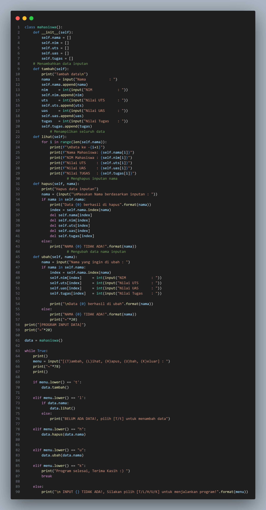

# pertemuan-12
## Latihan

### Tugas Praktikum

 Buat program sederhana dengan mengaplikasikan penggunaan class. Buatlah

 class untuk menampilkan daftar nilai mahasiswa, dengan ketentuan:

 • Method tambah() untuk menambah data

 • Method tampilkan() untuk menampilkan data

 • Method hapus(nama) untuk menghapus data berdasarkan nama

 • Method ubah(nama) untuk mengubah data berdasarkan nama

